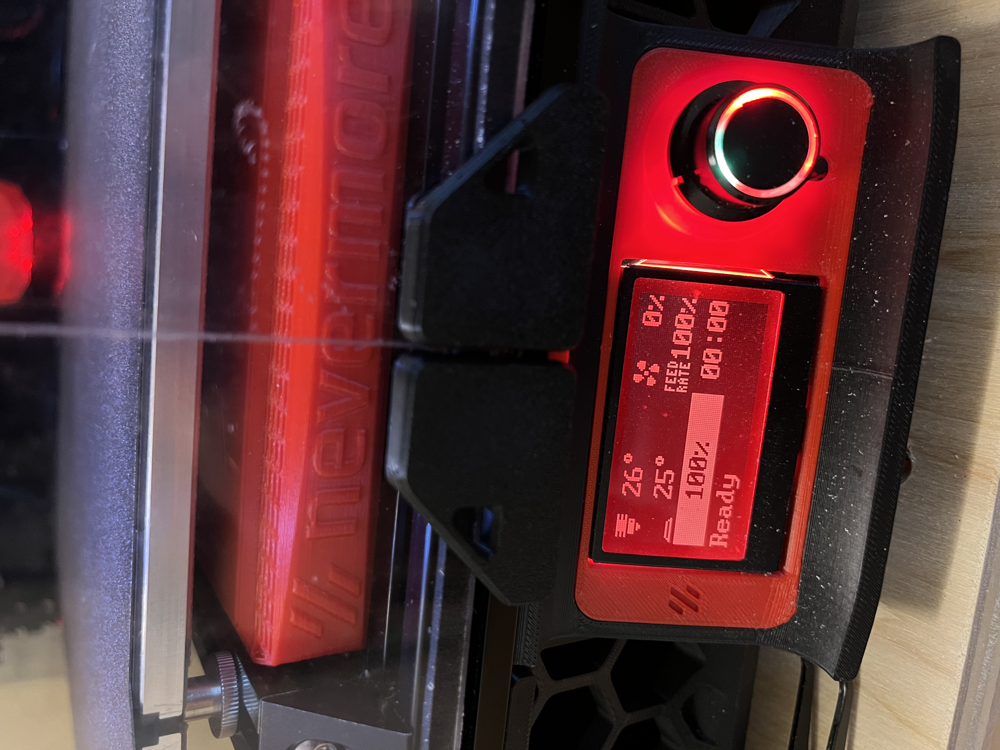
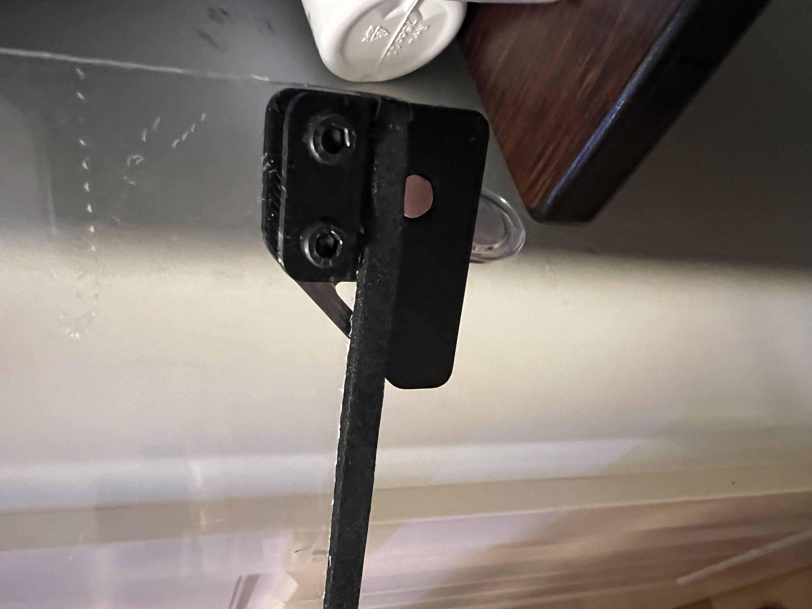
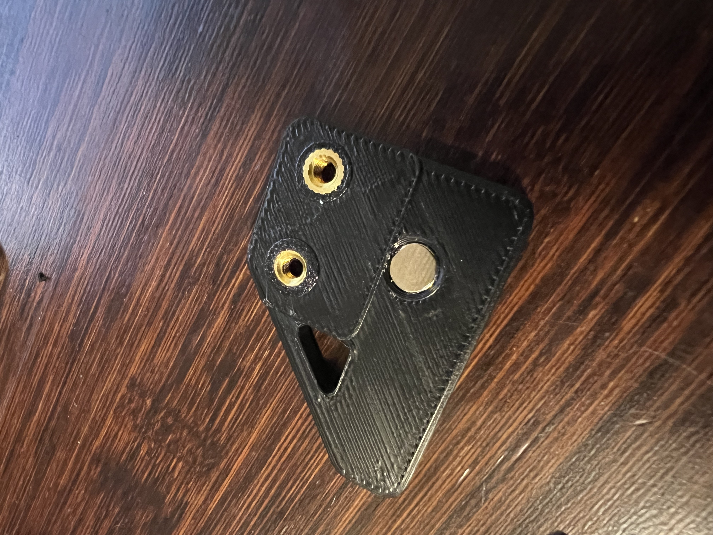

# Voron 2.4 Bolted Door Handle/Latch

After re-taping my stock voron doors over, and over, and over again, I finally got tired of it and went looking for something better. I finally settled on these removable bolt-on hinges:

https://github.com/VoronDesign/VoronUsers/tree/master/printer_mods/ElPoPo/RemovableDoors

These doors are great, because not only are they solid (bolted on), but you can remove your doors whenever you need to do work on the printer.

HOWEVER, noone has done the same (that I can find) for the door handles.  So I decided to grow my own.  I took the adapted from stock handle that the above link provided, extended the bottom a bit to make room for some heatsets and bolts that won't interfere with the extrusion, and modified the stock latch depth to allow the doors to sit flush with the extrusion when all is done.

Make no mistake, this is a total hack - my cad-fu is not strong and I munged this together in tinkercad, but I'm happy with the results.  A few notes:

BOM:
- 8 x heatsets (3x5x4mm)
- 8 magnets (6x3mm)
- 2 x M3x8 SHCS
- 2 x M3 hammerhead t-nuts
- 5x3mm foam tape for the doors to keep the doors insulated after installing the hinges

The hinge documentation is a bit sparse - it assumes you have 3mm tape around your doors.  I didn't originally, so I added it and was actually quite happy with the results.   But I wasn't happy with the latch he provided, so I adjusted the stock latch myself to allow the doors and my handles to sit flush.

Drilling out the holes turned out to be easier than I thought.  I used a manual hand drill so as not to be too agressive on the acrylic and make a mistake, YMMV.  But if you want one, this is the type I picked up:

https://www.amazon.ca/gp/product/B07KLRX6HQ/ref=ppx_yo_dt_b_search_asin_title?ie=UTF8&psc=1

Distances for holes:

10.2mm from top/bottom of door to holes
6mm from side of door to hole
12mm between holes

All above measurements are to center of hole (not edge)

