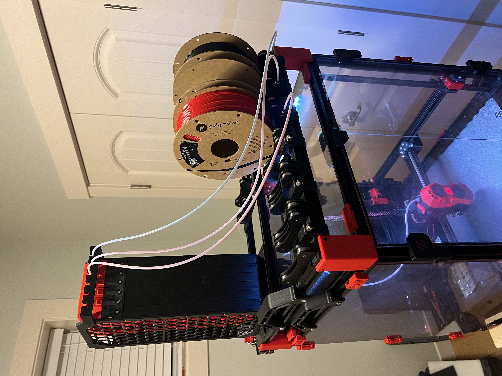
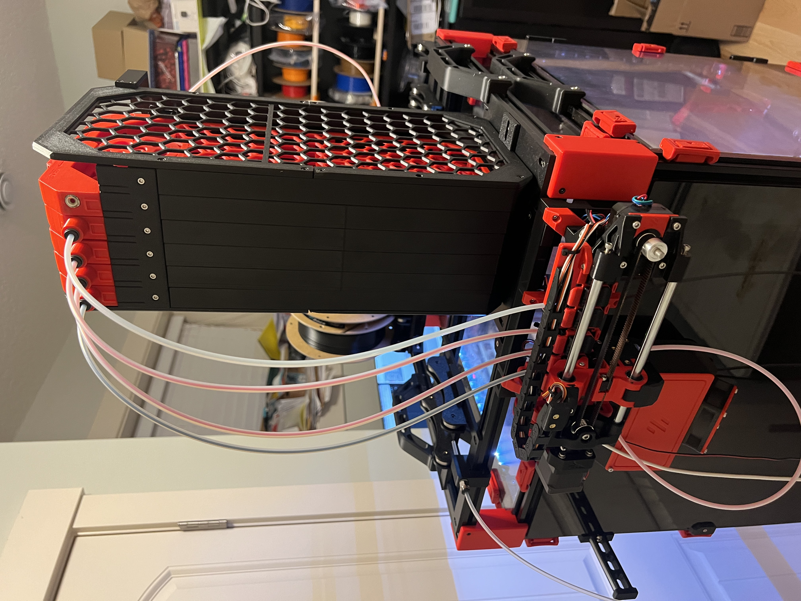
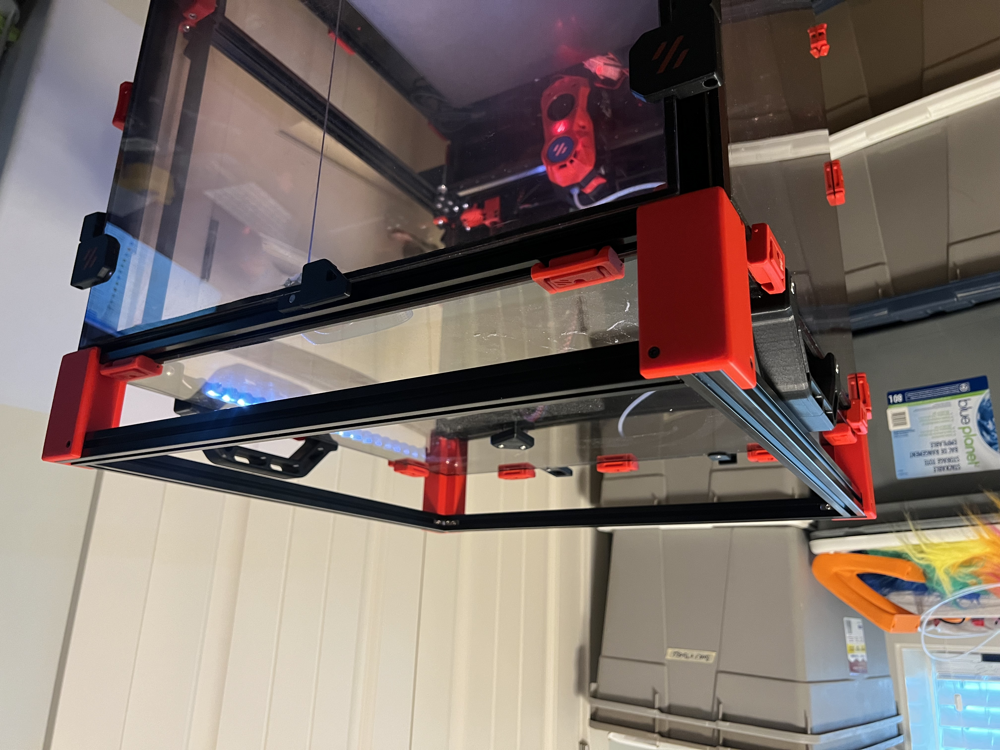
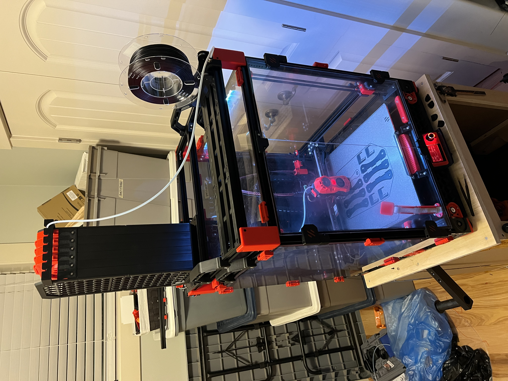
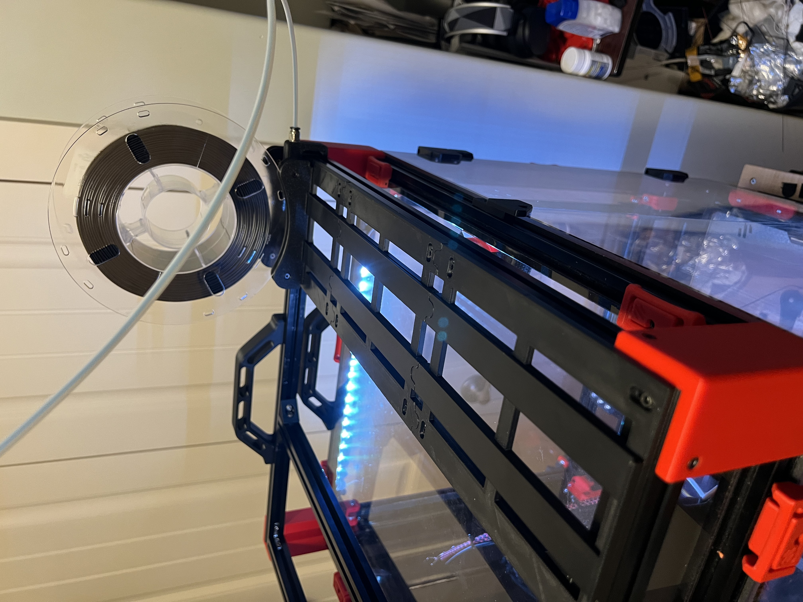
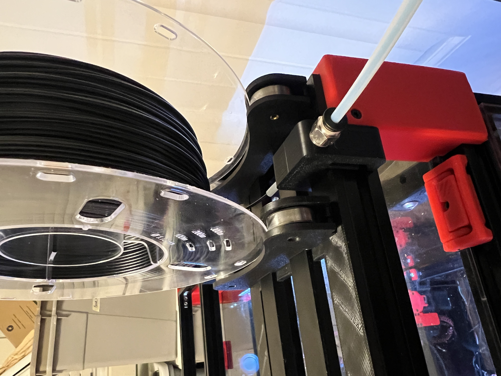

# Filament spool Rack

This is a major modification to the Filament Coil - Width Slider by Seabird, which can be found here:

https://cults3d.com/en/3d-model/tool/filament-coil-width-slider-seabird

My goal was to build a top frame on my v2.4 350 to hold my ercf, buffer, and all six spools.  It needed to be stable, but also easy to remove without having to unload everything, for maintenance. So I built a 2020 frame the same size as the 350, on risers so that it sits above the handles I have on the top of my printer.  I used these same handles also on the top rack itself for easy lifting.  The sturdy handles I used can be found here:

https://github.com/VoronDesign/VoronUsers/tree/master/printer_mods/jeoje/Sturdy_Handles

The idea behind my modifications to the filament holders was to make the sliding rails that held the filament steady but that could be adjusted to account for different width spools. The Bowden Mount pops over top of the rail and 2020 extrusion.

For the buffer I modified Geoff Young's Pika buffer to double the height.  His buffer is fabulous, I just found that I would get the occasional tangle inside the buffer, so by doubling the height I was able to reduce the filament to two loops, and my problems went away.  The downside is that it's TALL.   But it works.   I also added a support rail to give the bowden magnet ends some support to keep them from popping off.

If you're interested in my modifications to the Pika buffer, look here:

https://github.com/pfielding/Voron/tree/main/Mods/Pika_Extended_Length_Mod

DISCLAIMER:  This stuff is a bit of a hack job.  But if you like it feel free to use it and hack it as desired.

Use 4 x 490mm extrusions to make an interlocked square the same size as the top of the printer.   Two more extrusions, 470mm in length, to go inside to allow for mounting everything.  I mounted the rear inside extrusion with a 160mm gap to make for a 200mm edge to edge mount for the buffer.  The front inside extrusion is mounted with a 99mm inside gap for a 129mm edge to edge mount for the rails. Don't ask me why it's 129 instead of 130. It just kinda worked out that way.

Mount the corner mounts with two M3 screws and t-nuts to the top frame, and a single M3 and t-nut to the printer.  the bottom M3 can be removed quickly for removal of the topper.

I think that's it, if you find I'm missing something let me know.  I haven't really provided detailed instructions here, so if you have any questions feel free to contact me at paul at fielding dot ca.

Filament Holder and Rail:
- Screw Side.stl
- Heatset Side.stl (install heatsets on this piece)
- Slider End.stl (print 2, one for each end)
- Slider Middle.stl

Misc:
- Bowden Mount.stl (use with PC4-M10 Pneumatic fittings, you can push the bowden all the way through and an inch out the back side)
- ERCF Rack Bracket.stl (print 4, use with M3 screws and hammerhead t-nuts for ease of removal)
- Slider Setandalone.stl (standalone filament mount, 200mm wide, can mount beside the ercf to act as a bypass roll holder)

