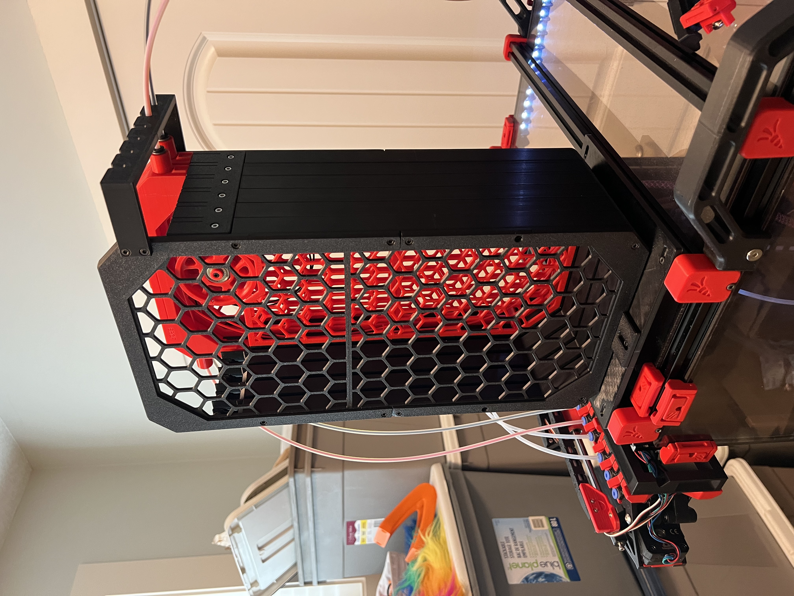
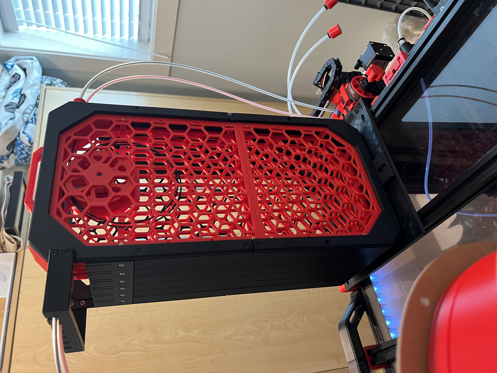
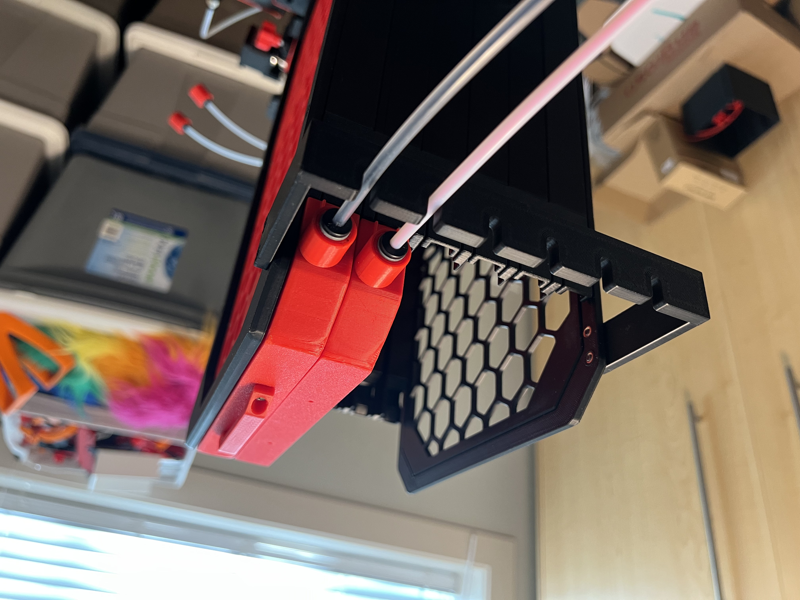
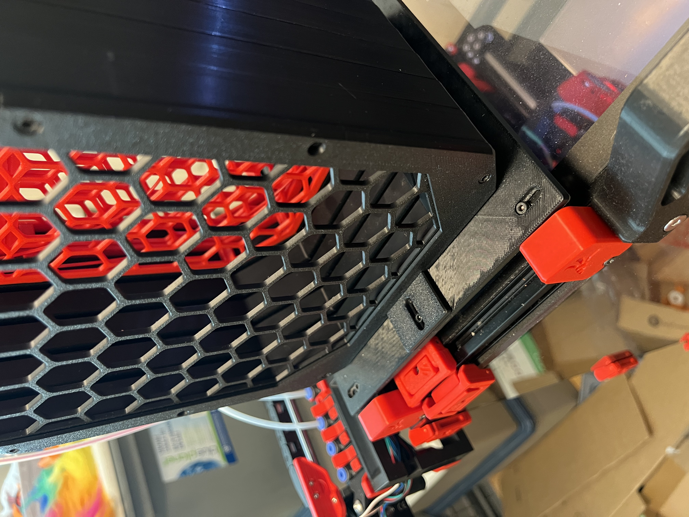

# Pika Filament Buffer Extended Length Mod

This is a modification to Geoff's fabulous Pika filament buffer, which can be found here:

https://github.com/geoffrey-young/pika-filament-buffer

This buffer system checks all the boxes, however I found that I would get occasional tangles in the wheel, especially with the fairly large number of loops I was using.  Geoff has been working on improving the wheel to reduce the potential for tangles, and it makes a huge difference.   I decided I wanted to try the approach of extending the length of the buffer and reduce the number of loops required.  By doubling the length of the buffer, I've been able to reduce my setup to 2 loops around the wheel, and I have yet to get a tangle since doing so.

Advantage: Reduced chances of tangles

Disadvantage:  It's BIG.  If you don't have a reasonable place to mount it, it'll take up space you may not want to lose.  

For me, I mount mine vertically on top of my printer, so going straight up wasn't a big deal.  It works for my purposes.

I also did some further mods:

- Added a bowden tube support to the array.  I just wanted a simple support that gave slide-in/slide-out support to the tubes where they enter the buffers, to allow the magnetic end to sit without strain.
- Modded the wall mount bracket to allow for easy mounting to a square mount plate that mounts onto a pair of extrusions on the top of my printer.
- Modded the magnet end and the buffer top to support the magnets I bought, which turned out to be roughly 10.8mm in diameter.  It turns out that you never know how big your '10mm magnets' are going to be, as Geoff discusses on his github.  I suspect I'm an anomaly here, but if you happen to get magnets that are this diameter, then I've got the parts for you here. :) 

I've also included a Notched version of the square mount plate for use with my Filament Spool Rack to allow the Ercf, buffer, and rack handle to all fit together nicely.  If you're interested in my Filament Spool Rack for top mounting on a v2.4 350, look here:

https://github.com/pfielding/Voron/tree/main/Mods/Filament_Spool_Rack

The above mods are optional of course.'

Lastly, I included short versions of the array front and back plates with the buffer support mod on them, just in case someone wants to use it with their original Pika.

DISCLAIMER:  My CAD-fu is not strong, these mods are total hacks.  If you can improve upon them please feel free to, I encourage it. :) I just did this to "get the job done."

This mod requires a 350x350mm build plate to print successfully.

BOM:
(additional to the standard Pika)
- 4 x M2x8 SHCS additional to the Pika BOM, per buffer
- 8-12 x M3x8 SHCS additional to the Pika BOM, for the extended array front and back covers
- 4 x heatsets (3x5x4mm) Optional, for the tube support
- 2 x heatsets (3x5x4mm) Optional, for the printer mounting plate

I think that's it, if you find I'm missing something let me know

Array:
- array-back-with-mount-long-b.stl
- array-back-with-mount-long-a.stl
- array-front-screen-long-b.stl
- array-front-screen-long-a.stl
- array-front-with-mount-long-b.stl
- array-front-with-mount-long-a.stl
- buffer_bottom-long.stl

Array - Short panels for original Pika with Bowden Support:
- array-front-with-mount-short.stl
- array-back-with-mount-short.stl

Buffers:
- buffer-front-long-b2.stl
- buffer-front-long-b1.stl
- buffer-front-long-a.stl

Bowden Support:
- pika-tube-support-6-buffers-v3.stl

Alternate Mounting Plate:
- filament_bracket_mounting_plate.stl
- filament_bracket_mounting_plate_ercf_notches.stl (alternate plate for if using my Top Spool Rack).
- array-bottom-bracket-6-3mmHole.stl

Mod for 10.8-ish mm magnets:
(the 11mm hole was required to fit the 10.8-ish mm magents properly)
- 11mm_buffer-top-magnet+magnet_v2.stl
- 11mm_magnet_end_v2.stl

